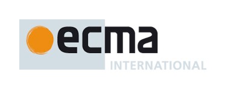

### Ecma International, TC53 EcmaScript Embedded Systems Documentation Software Contribution Form

This is a simplified, online version of the Ecma International, TC53 [Software Submitter Contribution Form](https://ecma-international.org/policies/by-ipr/ecma-international-policy-on-submission-inclusion-and-licensing-of-software/) and associated [policies]() for use with contributions to all versions of the ECMA-419 documentation website content and for possible use of that content.

#### I. General Information

<div class="not-content">
    <iframe src="https://docs.google.com/forms/d/1ROWt0GApnI_19yfT4wKR8M-yxEw68pc0ESTKsLiFLLw/viewform?embedded=true" width="760" height="1200" frameborder="0" marginheight="0" marginwidth="0">Loading...</iframe>
</div>

#### II. Representations and Warranties; Disclaimer of Other Warranties; Grant of Copyright License

1. Software Submitter represents and warrants at the time of this submission by it that, (i) if Software Submitter is making the submission on behalf of an entity, (A) such entity has authorized the submission, and (B) the Software Submitter signing this agreement is hereby authorized to make Software submissions on behalf of the legal entity, (ii) to the reasonable knowledge of the employee or individual actually making the submission, the submission is subject to the terms of Ecma International Policy on Inclusion of Software in Standards and Technical Reports (the ”Policy”) [available at https://ecma-international.org/policies/by-ipr/ecma-international-policy-on-submission-inclusion-and-licensing-of-software/] and does not violate the copyright or trade secret interests of another, and (iii) nothing in the submission is subject to any third party software license agreement that is inconsistent with the Policy or that could impose an additional obligation on any party using the Software as contemplated by Ecma International (such as, without limitation, an open source license with on-going obligations to distribute source code or to license additional intellectual property rights on a royalty-free basis if the software is redistributed).
1. SOFTWARE SUBMITTER DISCLAIMS ALL WARRANTIES (EXCEPT THOSE SET FORTH IN SECTION II. A ABOVE), EXPRESS OR IMPLIED, INCLUDING, BUT NOT LIMITED TO, (I) ANY WARRANTY OF TITLE OR THAT THE SUBMISSION DOES NOT INFRINGE THE INTELLECUTAL PROPERTY RIGHTS OF ANY OTHER PERSON OR ENTITY, (II) ANY IMPLIED WARRANTIES OF MERCHANTABILITY AND FITNESS FOR A PARTICULAR PURPOSE, AND (III) THAT THE RIGHTS AND LICENSES GRANTED HEREUNDER COMPRISE ALL THE RIGHTS AND LICENSES NECESSARY OR DESIRABLE TO PRACTICE DEVELOP, MAKE OR SELL PRODUCTS WHICH IMPLEMENT THE SOFTWARE.
1. Software Submitter either (choose one):
    1. [X] hereby grants a license to the Software pursuant to the BSD License set forth below.
    1. [ ] hereby grants to Ecma International and its members, an irrevocable, worldwide perpetual, royalty free, nontransferable, non-exclusive license under its copyrights in its software submission to modify such software submission and reproduce the modified or unmodified software submission for the sole purpose of developing an Ecma standard . Requires submission of PDF form linked above.
1. Software Submitter hereby grants to Ecma International, a worldwide, irrevocable, nontransferable royalty free copyright license to reproduce, create derivative works, distribute, display, perform and sublicense the rights to reproduce, make derivative works of , distribute, display and perform its copyright interest in its Software submission or portions thereof incorporated into final Ecma International Standards. 
1. Software Submitter acknowledges that, while Software Submitter continues to own the copyright in the Software that it submits, Ecma International owns, and has the right to enforce, the copyright in the collective work (e.g., the Ecma International Standard that incorporates all text and Software contributions). 
1. Software Submitter acknowledges the applicability of and agrees to abide by the terms of the Ecma Code of Conduct in Patent Matters with respect to patents that are required to implement the subject final Ecma International Standard.
1. Except as expressly set forth herein, the Software Submitter reserves for itself all other intellectual property rights in its Software submission and makes no assignment, license or other transfer or any other intellectual property rights.

#### Attachment 1: BSD License

Replace YEAR and OWNER with appropriate values.

```
Copyright (c) &lt; YEAR &gt;, &lt; OWNER &gt; All rights reserved. Redistribution and use in source and binary forms, with or without modification, are permitted provided that the following conditions are met:

1. Redistributions of source code must retain the above copyright notice, this list of conditions and the following disclaimer.
2. Redistributions in binary form must reproduce the above copyright notice, this list of conditions and the following disclaimer in the documentation and/or other materials provided with the distribution.
3. Neither the name of the copyright holder nor the names of its contributors may be used to endorse or promote products derived from this software without specific prior written permission.  

THIS SOFTWARE IS PROVIDED BY THE COPYRIGHT HOLDERS AND CONTRIBUTORS "AS IS" AND ANY EXPRESS OR IMPLIED WARRANTIES, INCLUDING, BUT NOT LIMITED TO, THE IMPLIED WARRANTIES OF MERCHANTABILITY AND FITNESS FOR A PARTICULAR PURPOSE ARE DISCLAIMED. IN NO EVENT SHALL THE COPYRIGHT HOLDER OR CONTRIBUTORS BE LIABLE FOR ANY DIRECT, INDIRECT, INCIDENTAL, SPECIAL, EXEMPLARY, OR CONSEQUENTIAL DAMAGES (INCLUDING, BUT NOT LIMITED TO, PROCUREMENT OF SUBSTITUTE GOODS OR SERVICES; LOSS OF USE, DATA, OR PROFITS; OR BUSINESS INTERRUPTION) HOWEVER CAUSED AND ON ANY THEORY OF LIABILITY, WHETHER IN CONTRACT, STRICT LIABILITY, OR TORT (INCLUDING NEGLIGENCE OR OTHERWISE) ARISING IN ANY WAY OUT OF THE USE OF THIS SOFTWARE, EVEN IF ADVISED OF THE POSSIBILITY OF SUCH DAMAGE.
```
